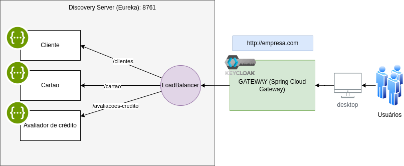

# Curso Domine Microservicos e Mensageria com Spring Cloud e Docker

## Diagrama

# Tecnologias

- Spring Cloud Eureka
- Spring Cloud Gateway
- RabbitMQ
- Keycloak
- Docker Compose
- H2

## Docker compose

[Arquivo Docker Compose](docker/docker-compose.yaml)

## KeyCloak Realm

[Arquivo de realm](docs/keycloak/realm-export.json)
